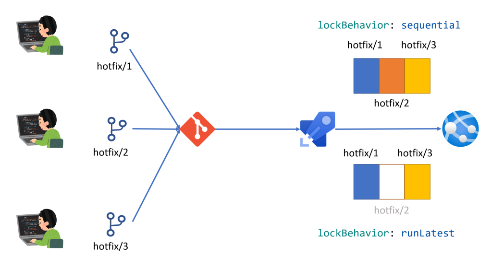
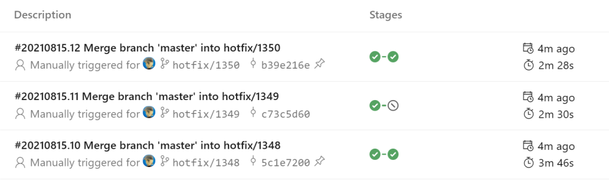
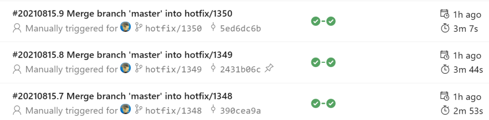

# Introduction 

This repository is sample for Azure Pipelines and Environment for ```lockBehavior```.

```lockBehavior``` is start for support in Sprint 190, document is [Support for sequential deployments rather than latest only when using exclusive lock checks](https://docs.microsoft.com/en-us/azure/devops/release-notes/2021/sprint-190-update#support-for-sequential-deployments-rather-than-latest-only-when-using-exclusive-lock-checks)

## What is lockBehavior

```lockBehavior: sequence``` is new feature.



Azure Pipelines and Environment, ```lockBehavior```'s default is ```runLatest```.

### runLatest



```runLatest``` is default behavior, YAML sample is [runLatest](azure-pipelines_hotfix_web.yml).```hotfix/1349``` branch is skipped.

### sequential



```sequential``` is new feature, YAML sample is [sequential](azure-pipelines_hotfix_web_sequence.yml).

```sequential``` deploy is cumulative.  
